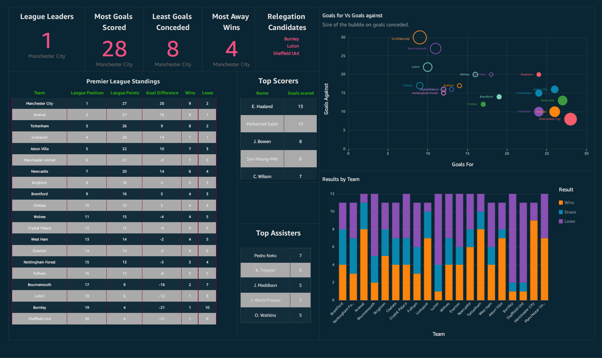

# Airflow Football ETL Project

This project uses Apache Airflow for orchestrating an ETL (Extract, Transform, Load) process related to football data. The ETL process retrieves football-related information, uploads it to an S3 bucket, and triggers a Glue job for further processing.

## Table of Contents

- [Prerequisites](#prerequisites)
- [Getting Started](#installation)
- [Project Workflow](#dag-overview)
- [Project Configuration](#configuration)
- [Dashboard Preview in Amazon QuickSight](#dashboard)
- [Contributing](#contributing)

## Prerequisites

Before you begin, ensure you have the following dependencies installed:

- [Apache Airflow](https://airflow.apache.org/)
- [AWS CLI](https://aws.amazon.com/cli/)
- [Python](https://www.python.org/)

## Getting Started

To get started with this project, follow these steps:

1. Clone the repository to your local machine:

   ```bash
   git clone https://github.com/JawaharRamis/PL-Football-ETL-with-Airflow-AWS.git
   ```

2. Change to the project directory:

3. Run the Docker Compose file to set up the project environment:

   ```bash
   docker-compose up -d

## Project Workflow

The project follows a streamlined workflow to retrieve, transform, and visualize football data. The process is orchestrated through Apache Airflow, leveraging custom operators and AWS Glue services. Here's a detailed breakdown of the workflow:

### 1. Retrieve Football Data
The retrieve_group_tasks task group is responsible for fetching raw football data from an API. This information, which includes details on top goal scorers and other relevant statistics, is then pushed onto Airflow's XCom system. This ensures seamless data sharing between tasks.

### 2. Upload to S3
The custom operator, UploadXComToS3Operator, takes the data from the XCom system and efficiently uploads it to an S3 bucket. The data is stored within the 'raw' object, maintaining a clear and organized structure in the S3 storage.

### 3. Data Processing with AWS Glue
#### 3.1 Glue Crawler
A Glue Crawler is executed on the raw football data stored in the S3 bucket. This automatically discovers the schema of the raw data, creating a catalog that will be used in subsequent processing steps.

#### 3.2 Glue Job Execution
A Glue job is triggered, utilizing the schema obtained from the Glue Crawler. This job processes the raw football data, transforming it into a structured format. The transformed data is then uploaded back to the same S3 bucket but under the 'transformed' object, maintaining a clear distinction between raw and processed data.

### 4. Visualization with Quicksight
The processed data is fed into Amazon Quicksight, a robust business intelligence tool. Quicksight enables intuitive and interactive data visualization, allowing stakeholders to gain valuable insights and make informed decisions based on the football statistics.


## Project Configuration
Configuring your football data ETL project involves setting up various components to ensure smooth execution. Below, guidance on the key configuration aspects are listed:

###  1. Environment Variables
Define the following environment variables to securely store sensitive information and project-specific configurations:

- FOOTBALL_API_KEY: API key for accessing football data via the RapidAPI platform.
- SEASON: Specify the football season for data retrieval.
- LEAGUE: Identify the football league for which data is being collected.
- AWS_ACCESS_KEY_ID and AWS_SECRET_ACCESS_KEY: AWS credentials for S3 access.
- AWS_DEFAULT_REGION: AWS region for S3 and Glue operations.

### 2. AWS Glue Configuration
Configure AWS Glue with the necessary IAM roles and permissions. Ensure that the Glue Crawler and Glue Job have the required access to your S3 bucket.

### 3. AWS S3 Configuration
Create an S3 bucket to store raw and transformed football data. Set appropriate bucket policies and permissions to allow access from AWS Glue and Apache Airflow.

### 4. Amazon Quicksight Configuration
Set up Amazon Quicksight with the appropriate permissions to access the processed data in your S3 bucket. Configure data sources and datasets within Quicksight to facilitate visualization.

### 5. RapidAPI Configuration
Sign up for a RapidAPI account and obtain an API key. Ensure that your RapidAPI account has access to the football API used in your project.

## Dashboard Preview in Amazon QuickSight

The real-time stock monitoring dashboard provides a comprehensive view of stock prices and key metrics. Below is a preview of the dashboard:

Visualizing the processed football data is a crucial aspect of deriving meaningful insights. Amazon QuickSight, a powerful business intelligence tool, allows you to create interactive and dynamic dashboards for enhanced data exploration. Below is a section that provides a preview of what the dashboard in Amazon QuickSight might look like:

- Premier League Standings
- Premeir League Top scorers
- Premier League Top Assisters
- Team performance visualization with GD
- Upcoming Fixtures
- Recent Results
- Key Statistics




## Contributing

Contributions to this project are welcome! To contribute:

    - Fork the repository.
    - Create a new branch for your feature or bug fix.
    - Make your changes and submit a pull request.

